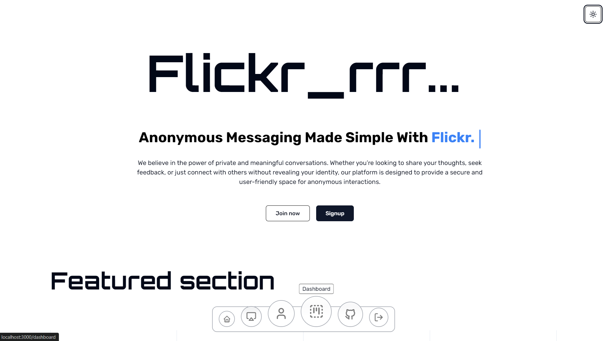
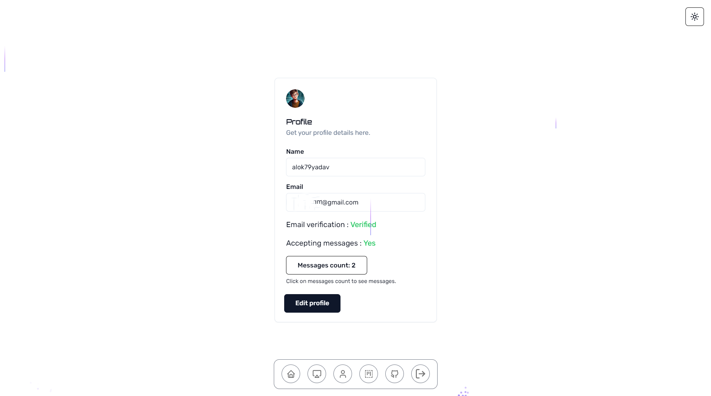
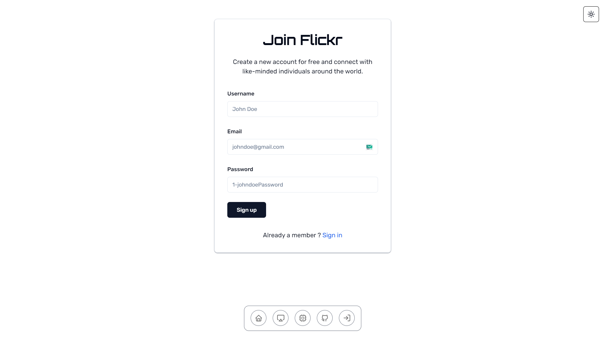
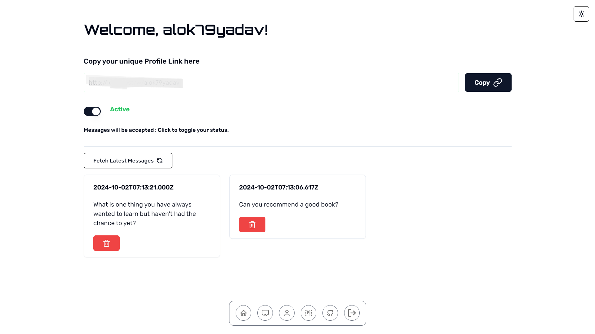

# Flickr

Flickr is an anonymous feedback application built with Next.js. This app allows users to manage anonymous feedback through a personalized dashboard. Users can share their profile link to receive messages or feedback anonymously, with the ability to accept or decline incoming messages.

## Features

-   **Anonymous Messaging:** Receive messages anonymously through a shareable profile link.
-   **Dashboard Management:** Accept or decline messages from your dashboard.
-   **Secure Authentication:** Managed via `next-auth`.
-   **Responsive Design:** Built with Tailwind CSS and styled using `shadcn` and `Aceternity UI` for a sleek and modern UI.
-   **AI Integration:** Uses OpenAI for enhanced features and insights.

## Tech Stack

-   **Framework:** [Next.js](https://nextjs.org/)
-   **UI Components:** [shadcn](https://ui.shadcn.com/), [Aceternity UI](https://ui.aceternity.com/), [Tailwind CSS](https://tailwindcss.com/)
-   **Forms & Validation:** [React Hook Form](https://react-hook-form.com/), [Zod](https://github.com/colinhacks/zod)
-   **Authentication:** [NextAuth.js](https://next-auth.js.org/)
-   **AI Integration:** [OpenAI](https://openai.com/)
-   **Database:** [MongoDB](https://www.mongodb.com/)

## Installation

To get started with Flickr, follow these steps:

1. **Clone the repository:**

    ```bash
    git clone https://github.com/alok-x0s1/flickr.git
    ```

2. **Navigate to the project directory:**

    ```bash
    cd flickr
    ```

3. **Install dependencies:**

    ```bash
    npm install
    ```

4. **Set up environment variables:**

    Create a `.env` file in the root directory and add your environment variables. Example:

    ```env
    MONGO_URI=your_mongodb_uri
    ACCESS_TOKEN_SECRET=your_jwt_access_token_secret
    ACCESS_TOKEN_EXPIRY=your_jwt_access_token_expiry
    DOMAIN=http://localhost:3000
    RESEND_API_KEY=your_resend_apikey
    NEXTAUTH_SECRET=your_nextauth_access_token_secret
    OPEN_API_KEY=your_openai_apikey
    ```

5. **Run the development server:**

    ```bash
    npm run dev
    ```

    Open [http://localhost:3000](http://localhost:3000) with your browser to see the app in action.

## Usage

1. **Sign Up/Login:** Create an account or log in to access your dashboard.
2. **Profile Link:** Share your unique profile link to start receiving anonymous feedback.
3. **Manage Messages:** View, accept, or decline messages directly from your dashboard.

# Overview

It is a simple and secure platform for anonymous feedback. It is built with Next.js, MongoDB, and NextAuth.js. Using this platform, you can share your thoughts and receive anonymous feedback from others.

## Home Page

The home page is the first page that you see when you open the app. It has a simple and clean design. It has a hero section with `Join now` and `Sign up` button. And below that, it has a features section.



## Profile

In the profile page, you can see your profile details and your messages count. And you also have the option to edit your profile details.



## Sign Up Page

The sign up page is the page that you see when you click on the `Sign up` button in the home page. It has a simple and clean design. It has a form with `Username`, `Email` and `Password` fields. And below that, it has a `Sign up` button.



## Dashboard

The dashboard page is the page where you can see all the messages you have received. Also have the option to accept or decline the messages and delete them.




## Contributing

Contributions are welcome! Please feel free to submit a Pull Request.

## Acknowledgements

-   [Next.js](https://nextjs.org/)
-   [Tailwind CSS](https://tailwindcss.com/)
-   [shadcn](https://ui.shadcn.com/)
-   [Aceternity UI](https://ui.aceternity.com/)
-   [NextAuth.js](https://next-auth.js.org/)
-   [OpenAI](https://openai.com/)
